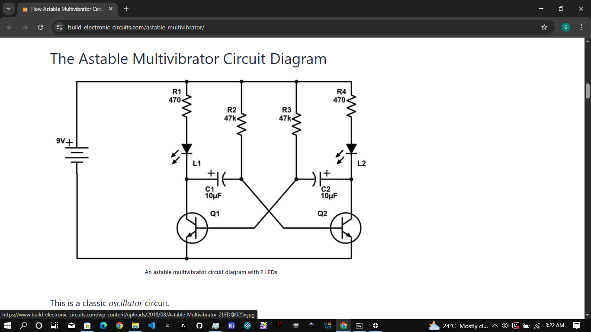

# 🔁 Astable Multivibrator

This is a basic transistor-based astable multivibrator circuit that alternately blinks two LEDs. It’s one of the most classic timing circuits used to generate a square wave without any ICs.

---

## 🧰 Components Used
- 2x NPN Transistors (e.g., 2n3904 npn)
- 2x LEDs (Any color)
- 2x Electrolytic Capacitors (10-100µF, the both of them should be the same)
- 2x Base Resistors (10kΩ)
- 2x Collector Resistors (1kΩ)
- Breadboard, jumper wires, and 9V battery

---

## 📐 Schematic

---

## 🖥️ Simulation (Falstad)

  
Real-time simulation done using [Falstad Circuit Simulator](https://falstad.com/circuit/)

---

## 📹 Real-life Demo

`/videos/VID_20250806_140842 (1).mp4` *(open via GitHub or clone the repo to play)*

---

## 🧠 How It Works

- The capacitors charge and discharge through the base of the opposite transistor.
- This alternating behavior causes the transistors to switch on/off, blinking the LEDs.
- The timing is controlled by the capacitor and resistor values.

---

## ✅ Status
Tested ✅ | Working perfectly

---

## 📅 Date Built
August 2025

---

> Simple, effective, and a great way to understand multivibrator circuits.
